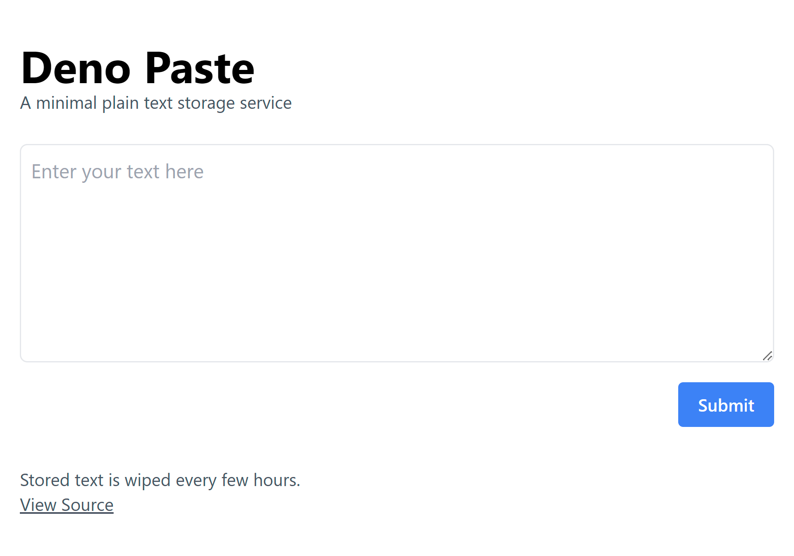

# Deno Paste

A minimal plain text storage service built using [Deno](https://deno.land/),
[Fresh](https://fresh.deno.dev/), [twind](https://twind.dev/) and
[Supabase](https://supabase.io/).

## Quickstart

Set up your `.env` with Supabase credentials:

```
cp .env.example .env
```

Create a Supabase project:

- Navigate to https://app.supabase.com/
- Create a new project
- Add a new database table to your project and name it `entries`.
- Change the `id` column type from `int8` to `text`.
- Add a new column to your table named `contents` with type `text`.
- Finally, go to Settings > API, copy the URL and api key and save to `.env`.

Then start the server:

```
deno task start
```
